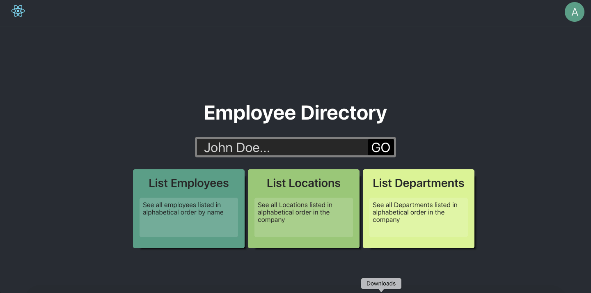
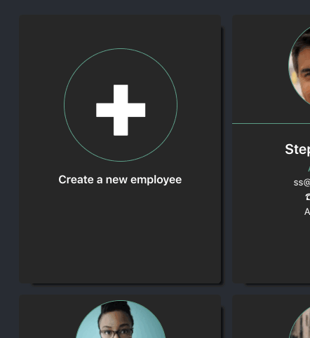
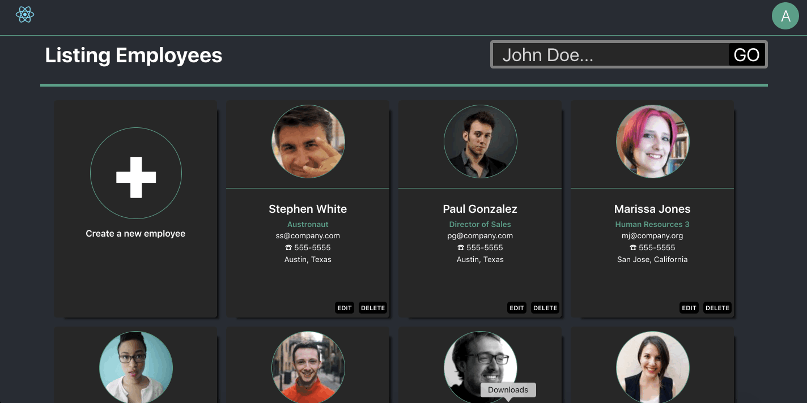

# React Employee Directory
This is a fun Full Stack Web app with EXPRESS on the backend serving up a simple JSON API and REACT/REACT-ROUTER on the client-side doing some pretty awesome stuff. 

## SET UP

1. Install Node v8.70 and yarn
 * https://docs.npmjs.com/downloading-and-installing-node-js-and-npm
```sh
node install
```

1. Install Dependencies via yarn
```sh
yarn install
```

## RUN APPLICATION
1. `yarn dev` (This runs the server on port 5000 and the client on port 3000)


## INTERFACE / VIEWS
1. "Home" view with persistant search feature



------
1. "Employees" view CREATE



-------
1. "Employees" view EDIT


-----
1. "Employees" view DELETE


------
1. "Employees" view SEARCH


1. Locations view


## BACK END / HIGHLIGHTS
1. Simple JSON API
- Unique Identifier(id) generation

1. Test Suite

## Improvements to make
* Pagination
* Photo Upload for edit (photos are randomly sourced from randomuser.me
* 
* Run app in localStorageMode when there is no access to the DB
* Accesibility
* Stylistically differentiate between Buy and Sell View
```
