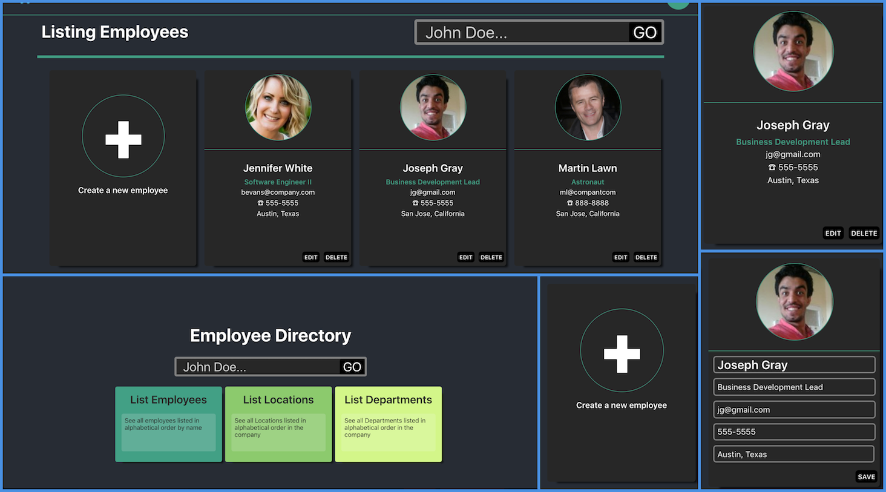

# React Employee Directory
This was a fun to create Full Stack Web app with EXPRESS on the backend serving up a simple JSON API and REACT/REACT-ROUTER on the client-side enabling some pretty sweet interface interactions. 


## SET UP

1. Install Node >= v8.70 and npm
 * https://docs.npmjs.com/downloading-and-installing-node-js-and-npm

1. Install Yarn
* https://www.npmjs.com/package/yarn

via Homebrew: 

```sh
brew install yarn
```

1. Install Client Dependencies via npm in the '/client' directory
```sh
cd client/
npm install
```

1. Install Dependencies via npm in root of project
```sh
cd ..
npm install
```


## RUN APPLICATION
1. `yarn dev` (This runs the server on port 5000 and the client on port 3000. A proxy is in place for the front end to communication to the back end. Go to localhost:3000 to see the app running)


## INTERFACE / VIEWS
1. "Home" view with persistant search feature


------
1. "Employees" view CREATE


-------
1. "Employees" view EDIT


-----
1. "Employees" view DELETE


------
1. "Employees" view SEARCH


1. Locations view


## BACK END / HIGHLIGHTS
1. Simple JSON API
- Unique Identifier(id) generation

## TEST SUITE
```sh
cd client/
npm test
```


## TODO
* Add Pagination to employee directory
* Form validation
* Real Photo Upload for edit - feature is currently mocked with generated photos from randomuser.me
* Componetize Search featue
* Add departments to the API

## RETROSPECT
* Manage scope-creep better, especially in terms of adding the locations view and departments view. 
* Implement Search Feature with more REACT-ISMS. Given the time constraints, implemented client side search with more focus on  vanilla javascript DOM manipulation. 
